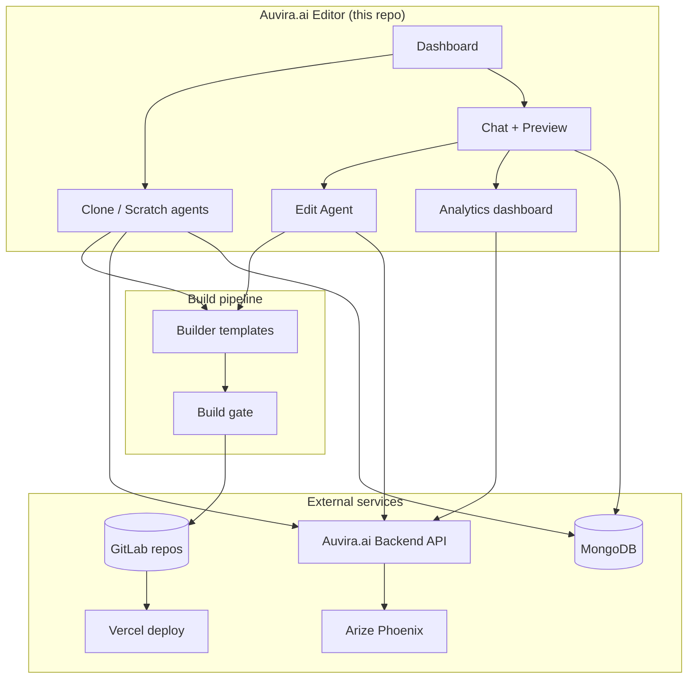

<p align="center">
  
</p>

<h1 align="center">
  <strong>Auvira</strong><span style="opacity:0.85">.ai</span>
</h1>

<p align="center">
  <strong>Editor</strong><br><br>
  <em>Augmented vision. Unlimited potential.</em>
</p>

<div align="center">

<table>
  <tr>
    <td align="center" style="border: 2px solid #0ea5e9; border-radius: 12px; padding: 18px 28px; background-color: #f0f9ff;">
      <h2>Auvira.ai Backend</h2>
      Observability · turn scoring · intent grounding · Phoenix traces<br>
      <a href="https://github.com/lamnguyen8075/auvira-ai-backend"><strong>github.com/lamnguyen8075/auvira-ai-backend</strong></a><br>
      <a href="https://la-mue-site-monitor-production.up.railway.app/docs">Production API docs</a>
    </td>
  </tr>
</table>

</div>

<br>

[Auvira.ai](https://auvira.ai) is an AI website teammate for small businesses — describe what you want, and Auvira creates, edits, remembers, and deploys your site. No drag-and-drop. No code.

**This repo is Auvira's editor** — the Next.js app owners use to clone, build, chat-edit, preview, and publish.

> **Dev note:** npm package / repo folder name remains `ai-website-migration-agent` for tooling compatibility.

---

## What this service does

Every time an owner works on their site, this app:

- **Extracts** business facts from an existing URL (clone) or a short intake form (scratch)
- **Generates** a one-page Next.js + Tailwind site from deterministic templates — the LLM produces JSON (`siteConfig`, copy, colors), not React source
- **Validates** every build locally before GitLab commit or Vercel deploy
- **Edits** via a GitLab-backed chat agent — scoped targets, rollback, diff review
- **Remembers** — calls the [Auvira.ai backend](https://github.com/lamnguyen8075/auvira-ai-backend) for coaching hints, intent grounding, and Phoenix traces
- **Analyzes** — per-project session quality dashboard (keyword cloud, coaching context, turn history)
- **Publishes** — syncs workspace to GitLab, SHA-pins Vercel deploy, marks the site live

The Auvira.ai backend runs the brain's memory. **This repo runs the editor and LLM.**

Built with **Next.js 14** · **TypeScript** · **MongoDB** · **GitLab** · **Vercel** · **Gemini** · **Auvira.ai Backend API**

---

## Why it exists

Website builders generate pages. They don't tell you whether the AI understood the owner, whether the site still builds, or what "do the same" actually means.

Auvira's editor closes that gap:

| Problem | How we solve it |
|---------|-----------------|
| Black-box AI edits | Every turn scored + traced via Auvira.ai backend (`POST /turns`) |
| Vague owner language | `GET /context` + `POST /intent` before each edit; implicit reference resolver |
| Repeating the same mistakes | Coaching hints fed into the planner when enabled |
| No safe publish path | Build gate — failed edits never replace the live site |
| Hard to scope edits | Drag any section or element from preview onto chat |
| No visibility into quality | Per-project **Analytics** at `/projects/[projectId]/observability` |

> Turn every owner message into a scoped, build-verified edit — then make the next one smarter.

Deep dive: [docs/EDIT_AGENT.md](docs/EDIT_AGENT.md) · [docs/OBSERVABILITY.md](docs/OBSERVABILITY.md)

---

## Live endpoints

| | URL |
|--|-----|
| **Editor (local dev)** | `http://localhost:3000` |
| **Auvira.ai backend (prod)** | `https://la-mue-site-monitor-production.up.railway.app` |
| **Backend API docs** | […/docs](https://la-mue-site-monitor-production.up.railway.app/docs) |
| **Analytics demo** | […/demo](https://la-mue-site-monitor-production.up.railway.app/demo) |
| **Backend health** | […/health/ready](https://la-mue-site-monitor-production.up.railway.app/health/ready) |
| **Phoenix traces** | [app.phoenix.arize.com/s/lamnguyen8075-sjsu](https://app.phoenix.arize.com/s/lamnguyen8075-sjsu) |

Production editor deploys via Vercel from `main`. Set `NEXT_PUBLIC_APP_URL` to your production domain. Root `/` redirects to `/intro`.

---

## How the editor uses the Auvira.ai backend

```text
Owner message in editor chat
       ↓
① GET  /context          → coaching hints from prior edits
①b POST /intent          → grounded intent sentence
②      Edit agent runs locally (plan → tools → verify)
③ POST /turns            → score + Mongo + Phoenix trace
       ↓
Repeat — each session gets smarter
```

```text
POST /turns  →  grade + Phoenix trace (builder.turn)
       ↓
GET /context  →  coaching hints  →  Gemini planner  →  POST /turns  →  …
```

Observability is **on by default** (shipped read-only client key). Set `OBSERVABILITY_ENABLED=0` to opt out.

**Integrating or extending the edit loop?** → [docs/EDIT_AGENT.md](docs/EDIT_AGENT.md) · [docs/OBSERVABILITY.md](docs/OBSERVABILITY.md)

---

## Architecture



| Layer | Role |
|-------|------|
| **MongoDB** | Users, projects, chat history, catalog, site health |
| **GitLab** | Generated customer sites — required for owner edits |
| **Vercel** | Hosts this app + customer sites |
| **Gemini** | Clone, scratch, edit planning, copy generation |
| **Auvira.ai backend** | Turn scoring, coaching, intent, Phoenix traces |
| **Templates** | `siteConfig.ts` drives rendering — LLM never emits React |

### Edit agent pipeline

```text
buildEditContext → resolveEditTarget → assessEditAmbiguity → resolveImplicitReferences
  → planEdit → executePlan → domain tools → verify → summarize
```

- **HTTP:** `POST /api/projects/[projectId]/code-agent/edit/stream` (SSE)
- **Runner:** `src/lib/project-workspace/websiteEditRunner.ts`
- **Agent:** `src/lib/project-workspace/edit-agent/index.ts`

Owners **drag a section or element from the preview iframe onto chat** to pin a `selectedTarget` for scoped edits.

### Preview modes

| Environment | Preview |
|-------------|---------|
| **Local dev** | Git clone → scratch disk → `next dev` → preview proxy |
| **Vercel (`VERCEL=1`)** | [Vercel Sandbox](https://vercel.com/docs/vercel-sandbox) — isolated VM, ~30 min TTL |
| **Live iframe** | Published Vercel URL — no drag-to-chat |

### Other features

- **Product catalog (Phase 2)** — MongoDB `Product` model; sync into draft `siteConfig`; static export with inquiry CTAs (no native checkout)
- **Site Manager** — scheduled checks (uptime, phone, hours, services, banner expiry); incidents and fix proposals via `/api/projects/[projectId]/site-manager/*`
- **Site analytics (generated sites)** — optional runtime on customer sites; collect endpoint at `/api/analytics/collect`
- **Commerce (Phase 3, not enabled)** — Stripe checkout stub in `src/lib/commerce/stripeConfig.ts`; not wired in `.env.example`

---

## Product modes

| Mode | Entry | Flow |
|------|--------|------|
| **Clone** | Dashboard → **Refresh from URL** | Crawl → plan → template → build → backup → publish |
| **Scratch** | Dashboard → **Start with a prompt** | Intake → plan → build → publish |

| Area | What owners see |
|------|-----------------|
| **Dashboard** | Getting-started checklist; in-progress clone jobs; project list |
| **Clone wizard** | Phase progress; template gallery; **Save backup copy** / **Publish live site** |
| **Editor** (`/projects/[projectId]`) | Draft preview; Chat / Changes / Publish tabs; sticky publish when there are unpublished edits |
| **Analytics** (`/projects/[projectId]/observability`) | Session quality — auto-loads on open: keyword cloud, coaching context, turn history (workspace tab: **Observability**) |
| **Landing** (`/intro`) | Product narrative and entry points for new owners |

Primary actions avoid GitLab/Vercel jargon — **backup copy**, **draft preview**, **live website**.

---

## API reference

**Auth:** Google OAuth (Auth.js) · **GitLab required** for owner edits (409 without link)

### Projects & generation

| Method | Path | Purpose |
|--------|------|---------|
| `GET` | `/api/projects` | List owner projects |
| `GET` | `/api/projects/{id}` | Project detail |
| `POST` | `/api/projects/clone` | Start clone flow |
| `POST` | `/api/projects/scratch/propose` | Generate website plan |
| `POST` | `/api/projects/scratch/build` | Build from plan |

### Edit loop

| Method | Path | Purpose |
|--------|------|---------|
| `POST` | `/api/projects/{id}/code-agent/edit/stream` | Owner edit (SSE) |
| `GET` | `/api/projects/{id}/messages` | Chat history |
| `GET` | `/api/projects/{id}/deployment-status` | Vercel deployment status |

### Observability

| Method | Path | Purpose |
|--------|------|---------|
| `GET` | `/api/projects/{id}/observability/bootstrap` | Backend health + conversations |
| `POST` | `/api/projects/{id}/observability/analyze` | Parallel session fetch (dashboard, intent profile, context) |
| `GET` | `/api/projects/{id}/observability/intent?userMessage=` | Turn-table intent lookup |
| `GET` | `/api/admin/observability` | Admin turn-score rollup |

### Other

| Method | Path | Purpose |
|--------|------|---------|
| `GET/POST` | `/api/projects/{id}/catalog` | Product catalog |
| `GET/POST` | `/api/projects/{id}/site-manager/*` | Site health checks |

Full edit-agent map: [docs/EDIT_AGENT.md](docs/EDIT_AGENT.md)

---

## Quick start

**Prerequisites:** Node.js 20 · MongoDB · Google OAuth · GitLab token + group · Gemini API key

```bash
git clone https://github.com/athan37/auvira.ai.git
cd auvira.ai
npm install
cp .env.example .env.local
cp .env.example .env          # optional; recommended for npm test
npm run dev
```

Open [http://localhost:3000](http://localhost:3000). Sign in → dashboard → create or open a project.

### Env vars

| Variable | Required | Purpose |
|----------|----------|---------|
| `MONGODB_URI` | Yes | MongoDB connection |
| `GOOGLE_CLIENT_ID` / `SECRET` | Yes | Google OAuth |
| `AUTH_SECRET` | Yes | Auth.js secret |
| `GITLAB_TOKEN` / `GROUP_ID` | Yes | Customer site repos |
| `GEMINI_API_KEY` | Yes | Clone, scratch, edit agent |
| `SITE_AGENT_VERCEL_TOKEN` | Optional | Deploy customer sites via Vercel API |
| `OBSERVABILITY_ENABLED` | Optional | Default on; set `0` to opt out |
| `OBSERVABILITY_COACHING_ENABLED` | Optional | Default on; set `0` to record turns without planner hints |

See [.env.example](.env.example) for the full list.

### GitLab & Google OAuth

1. GitLab personal access token: scopes `api`, `read_user`, `read_repository`, `write_repository`
2. [Google Cloud Console](https://console.cloud.google.com/) → OAuth 2.0 Client ID (Web)
3. Redirect URI: `http://localhost:3000/api/auth/callback/google`

---

## Docs

| Doc | What it's for |
|-----|---------------|
| [AGENTS.md](AGENTS.md) | AI agent / contributor guide: credentials, testing gates, key paths |
| [EDIT_AGENT.md](docs/EDIT_AGENT.md) | Edit pipeline, selected target, implicit references |
| [OBSERVABILITY.md](docs/OBSERVABILITY.md) | Auvira.ai backend integration, coaching, Phoenix traces, analytics API |
| [VERCEL_SANDBOX_IMPLEMENTATION.md](docs/VERCEL_SANDBOX_IMPLEMENTATION.md) | Sandbox preview on Vercel |
| [DESIGN_SYSTEM.md](docs/DESIGN_SYSTEM.md) | UI tokens, components, motion |
| [STYLING_THEMES.md](docs/STYLING_THEMES.md) | Product chrome + generated site themes |
| [CLONE.md](docs/CLONE.md) | Clone workflow |

---

## Deploy & test

**Deploy:** Connect repo to [Vercel](https://vercel.com) · production branch `main` · set env vars (MongoDB, OAuth, GitLab, Gemini). Add production URL to Google OAuth redirect URIs.

**Customer sites:** Publish syncs workspace → GitLab → SHA-pinned Vercel build. Verify with:

```bash
npx tsx scripts/e2e-deploy-verify.ts --project-id <id>
```

**Test:**

| Tier | Command | When |
|------|---------|------|
| Fast deterministic | `npm run test:contracts` | Section color pipeline (~1s) |
| Full unit (no LLM) | `npm test` | CI default (~5–15s) |
| Observability unit | `npm run test:observability` | Backend parsers, API wiring, keyword cloud |
| **Final gate** | `npm run test:all` | Unit + contracts (no LLM) |
| Live LLM | `npm run test:llm` | **Only when you explicitly request** (API cost) |

```bash
npm run test:all
npm run typecheck && npm run build   # when types or build paths change
```

CI ([`.github/workflows/ci.yml`](.github/workflows/ci.yml)): `typecheck` → `test` → `test:contracts` → `build` — no live LLM.

For agent workflow details and preview drag-to-chat troubleshooting, see **[AGENTS.md](AGENTS.md)**.

---

## Key paths

| Area | Path |
|------|------|
| Builder / templates | `src/lib/builder/` |
| Clone workflow | `src/lib/clone/` |
| Scratch workflow | `src/lib/agent/` |
| Edit agent | `src/lib/project-workspace/edit-agent/` |
| Edit runner | `src/lib/project-workspace/websiteEditRunner.ts` |
| Section color / presentation | `src/lib/project-workspace/sectionPresentationEdit.ts` |
| Edit context / implicit refs | `src/lib/project-workspace/edit-context/` |
| Observability client | `src/lib/observability/` |
| Per-project analytics UI | `src/components/project/ProjectObservabilityDashboard.tsx` |
| Observability API routes | `src/app/api/projects/[projectId]/observability/` |
| Preview proxy + bridge | `src/lib/preview/` |
| Project editor UI | `src/app/projects/[projectId]/page.tsx` |
| Synthetic test fixtures | `tests/support/syntheticSiteWorkspace.ts` |

---

<p align="center">
  <strong>Auvira.ai</strong> — the AI operating layer for small businesses.<br>
  This repo powers the editor behind every edit.
</p>
